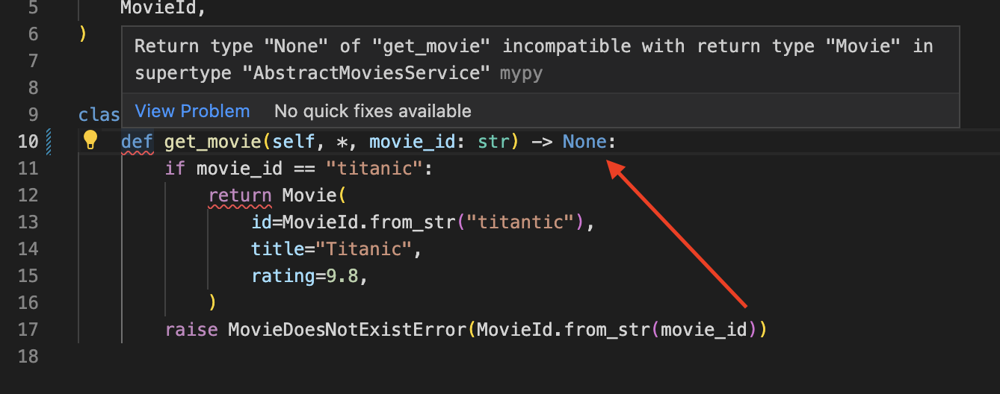

Fern has a first-class integration with FastAPI. Fern automatically generates:

- Pydantic models for your API types
- Exceptions that you can throw for non-200 responses
- Abstract classes for you to define your business logic.

All the networking/HTTP logic is auto-generated by Fern under the hood.

Repos:

- [Venus](https://github.com/fern-api/venus) is a Python FastAPI server that uses Fern under the hood.
- The [Fern FastAPI Starter](https://github.com/fern-api/fastapi-starter) is a simple example of a Fern-powered FastAPI server.

## Example

Let's walk through the [Fern FastAPI Starter](https://github.com/fern-api/fastapi-starter).

### Step 1: Define the API

```yaml fern/api/specification/imdb.yml
service:
  auth: false
  base-path: /movies
  endpoints:
    getMovie:
      method: GET
      path: /{movieId}
      path-parameters:
        movieId: MovieId
      response: Movie
      errors:
        - MovieDoesNotExistError

types:
  MovieId: string

  Movie:
    properties:
      id: MovieId
      title: string
      rating:
        type: double
        docs: The rating scale is one to five stars

  CreateMovieRequest:
    properties:
      title: string
      rating: double

errors:
  MovieDoesNotExistError:
    status-code: 404
    type: MovieId
```

### Step 2: Run `fern generate`

This generates all the boilerplate code into [generated/](https://github.com/fern-api/fastapi-starter/tree/main/backend/src/fern_fastapi_starter/api/generated).

```
$ fern generate
[api]: fernapi/fern-fastapi-starter Downloaded to backend/src/fern_fastapi_starter/api/generated
┌─
│ ✓  fernapi/fern-fastapi-server
└─
```

### Step 3: Implement the server

Notice you only need to provide the business logic. Just implement the function, and Fern takes care of the rest.

```python backend/src/fern_fastapi_starter/movies_service.py
from .generated.fern import AbstractMoviesService, Movie, MovieDoesNotExistError, MovieId

class MoviesService(AbstractMoviesService):
    def get_movie(self, *, movie_id: str) -> Movie:
        if movie_id == "titanic":
            return Movie(
                id=MovieId.from_str("titantic"),
                title="Titanic",
                rating=9.8,
            )
        raise MovieDoesNotExistError(MovieId.from_str(movie_id))
```

And register your endpoints with Fern, which registers them with FastAPI under the hood:

```python backend/src/fern_fastapi_starter/server.py
from fastapi import FastAPI

from .generated.fern.register import register
from .movies_service import MoviesService

app = FastAPI()

register(app, imdb=MoviesService())
```

### Step 4: Compile

The type checker will warn you if you make mistakes implementing your API.


If you change the signature of the endpoint method, you'll get an error:



You can use the command line to check for compile errors:

```
$ poetry run mypy
Success: no issues found in 24 source files
```

### Step 5: Run the server

```
$ poetry run start
INFO:     Uvicorn running on http://0.0.0.0:8080 (Press CTRL+C to quit)
INFO:     Started reloader process [32816] using StatReload
INFO:     Started server process [32829]
INFO:     Waiting for application startup.
INFO:     Application startup complete.
```

### Step 6: Hit the API &nbsp;🚀

```bash
$ curl --location --request GET --silent 'localhost:8080/movies/titanic' | jq .
{
  "id": "titantic",
  "title": "Titanic",
  "rating": 9.8
}

$ curl --location --request GET --silent 'localhost:8080/movies/oceans-11' | jq .
{
  "error": "MovieDoesNotExistError",
  "errorInstanceId": "f6e1d69c-bf97-42d5-bc89-5e42773e3880",
  "content": "oceans-11"
}
```

### Demo video

<iframe
  src="https://www.loom.com/embed/42de542022de4e55a1349383c7a465eb"
  width="100%"
  height="600px"
></iframe>
